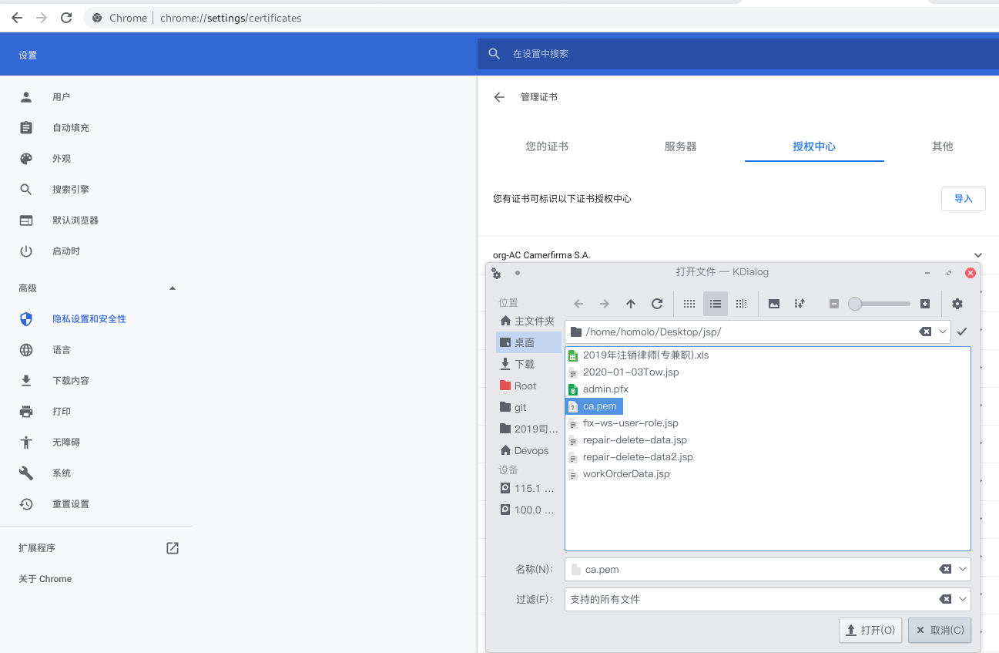
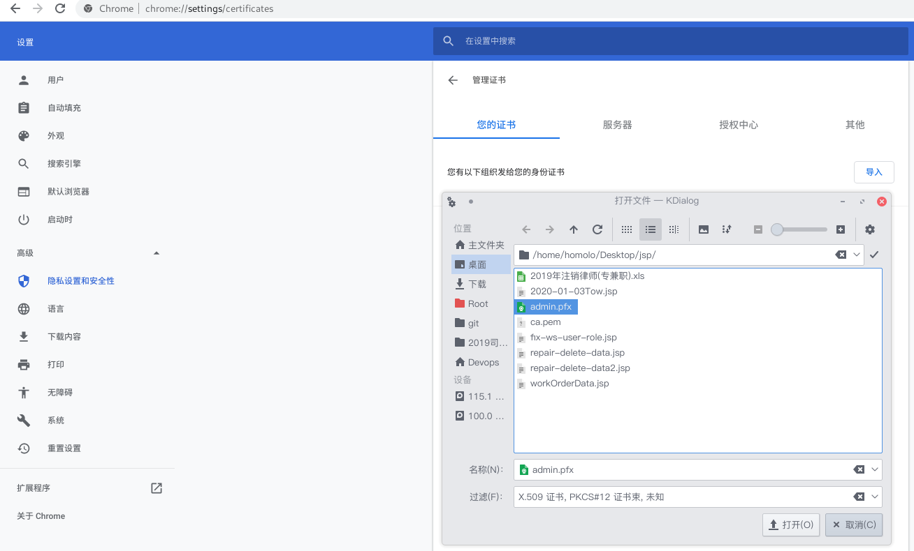
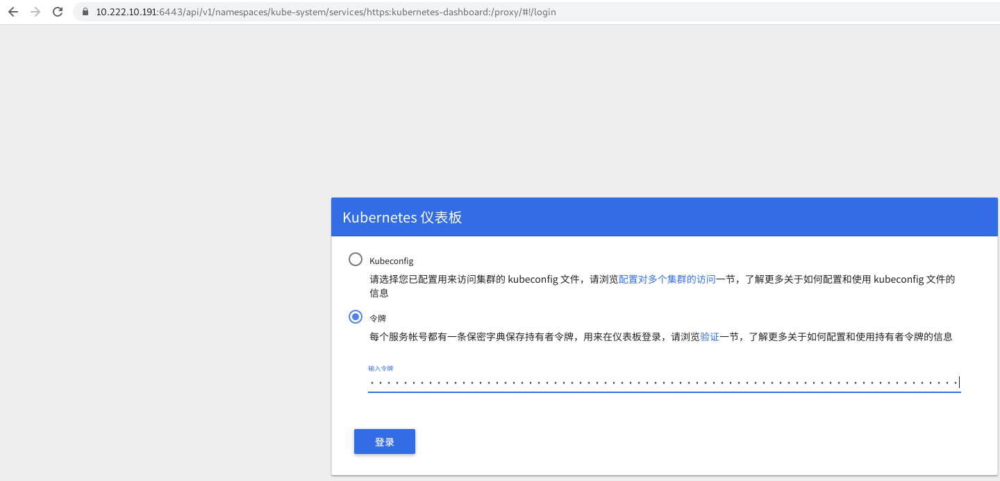

# install

## 参考文档
[kubeasz](https://github.com/easzlab/kubeasz)
[follow-me-install-kubernetes-cluster](https://github.com/opsnull/follow-me-install-kubernetes-cluster)

## 单节点部署
    使用kubeasz的aio单节点部署,[传送门](https://github.com/easzlab/kubeasz/blob/master/docs/setup/quickStart.md)

### 环境介绍
OS: Ubuntu Server 16.04.3
HostName: k8s-master
IP: 10.222.10.191
Mem: 2048M

### 1. 基础配置
```bash
# 配置ssh
sudo su
apt-get install openssh-server
ssh-keygen
cat ~/.ssh/id_rsa.pub >> ~/.ssh/authorized_keys
# 配置基础apt镜像
~~~
```

### 2. 下载安装文件
```bash
# 下载工具脚本easzup，举例使用kubeasz版本2.0.2
cd /data
export release=2.0.2
curl -C- -fLO --retry 3 https://github.com/easzlab/kubeasz/releases/download/${release}/easzup
chmod +x ./easzup
# 使用工具脚本下载
./easzup -D
```

上述脚本运行成功后，所有文件（kubeasz代码、二进制、离线镜像）均已整理好放入目录/etc/ansilbe

    /etc/ansible 包含 kubeasz 版本为 ${release} 的发布代码
    /etc/ansible/bin 包含 k8s/etcd/docker/cni 等二进制文件
    /etc/ansible/down 包含集群安装时需要的离线容器镜像
    /etc/ansible/down/packages 包含集群安装时需要的系统基础软件

### 3. 安装集群
1. 容器化运行 kubeasz，详见[文档](https://github.com/easzlab/kubeasz/blob/master/docs/setup/docker_kubeasz.md)
    ```bash
    ./easzup -S
    ```
2. 使用默认配置安装 aio 集群
    ```bash
    docker exec -it kubeasz easzctl start-aio
    ```

### 4. 验证安装
```bash
# 刷新bash环境使环境变量生效
exec bash
kubectl version                   # 验证集群版本     
kubectl get componentstatus       # 验证 scheduler/controller-manager/etcd等组件状态
kubectl get node                  # 验证节点就绪 (Ready) 状态
kubectl get pod --all-namespaces  # 验证集群pod状态，默认已安装网络插件、coredns、metrics-server等
kubectl get svc --all-namespaces  # 验证集群服务状态
```

### 5. dashboard
1. 安装
```bash
# 部署dashboard 主yaml配置文件
kubectl apply -f /etc/ansible/manifests/dashboard/kubernetes-dashboard.yaml
# 创建可读可写 admin Service Account
kubectl apply -f /etc/ansible/manifests/dashboard/admin-user-sa-rbac.yaml
# 创建只读 read Service Account
kubectl apply -f /etc/ansible/manifests/dashboard/read-user-sa-rbac.yaml
```

2. 验证
```bash
# 查看pod 运行状态
kubectl get pod -n kube-system | grep dashboard
kubernetes-dashboard-5c7687cf8-4sgb5   1/1       Running   0          22s
# 查看dashboard service
kubectl get svc -n kube-system|grep dashboard
kubernetes-dashboard      NodePort    10.68.237.166   <none>        443:39583/TCP                 53m
# 查看集群服务
kubectl cluster-info|grep dashboard
kubernetes-dashboard is running at https://10.222.10.191:6443/api/v1/namespaces/kube-system/services/https:kubernetes-dashboard:/proxy
# 查看pod 运行日志
kubectl logs kubernetes-dashboard-5c7687cf8-4sgb5 -n kube-system
```

3. 访问控制
    查看集群服务中获取到web[访问方式](https://10.222.10.191:6443/api/v1/namespaces/kube-system/services/https:kubernetes-dashboard:/proxy),dashboard提供两种验证方式验证:Kubeconfig、令牌(Token)
这里采用令牌登录.
浏览器中打开控制台选择“令牌(Token)”方式登录，复制下面输出的admin token 字段到输入框登录即可
```bash
# 创建Service Account 和 ClusterRoleBinding
kubectl apply -f /etc/ansible/manifests/dashboard/admin-user-sa-rbac.yaml
# 获取 Bearer Token，找到输出中 ‘token:’ 开头那一行
kubectl -n kube-system describe secret $(kubectl -n kube-system get secret | grep admin-user | awk '{print $1}') 
```

### dashboard踩坑
#### 访问web页面提示不被信任


1. 获取根证书
```bash
# 根证书位置
ls -l /etc/ansible/.cluster/ssl/ca.pem
```
2. `chrome浏览器`添加根证书
'设置' --- '隐私设置和安全性' --- '管理证书' ---'授权中心'---'导入'---'选择拷贝下来的ca.pem'


3. 新窗口打开dashboard,证书已被信任

#### 401 未授权的访问
1. 我们需要给浏览器生成一个 client 证书，访问 apiserver 的 6443 https 端口时使用。
> 这里使用部署 kubectl 命令行工具时创建的 admin 证书、私钥和上面的 ca 证书，创建一个浏览器可以使用 PKCS#12/PFX 格式的证书：

```bash
openssl pkcs12 -export -out admin.pfx -inkey /etc/ansible/.cluster/ssl/admin-key.pem -in /etc/ansible/.cluster/ssl/admin.pem -certfile /etc/ansible/.cluster/ssl/ca.pem

ls -l $PWD/admin.pfx
```
2. 导入到`chrome浏览器`
'设置' --- '隐私设置和安全性' --- '管理证书' ---'您的证书'---'导入'---'选择拷贝下来的admin.pfx'


### dashboard登录
使用上面获取到的token令牌
