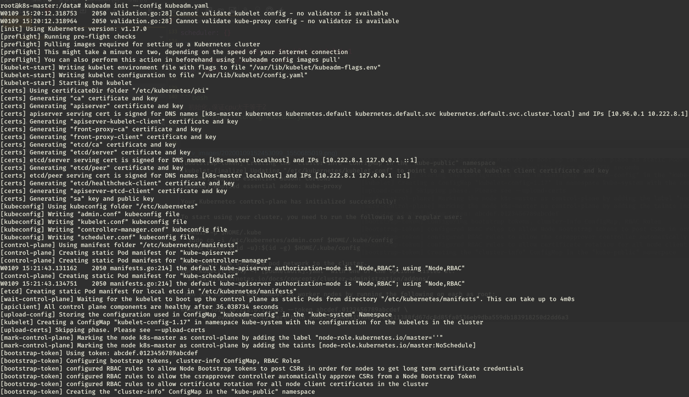
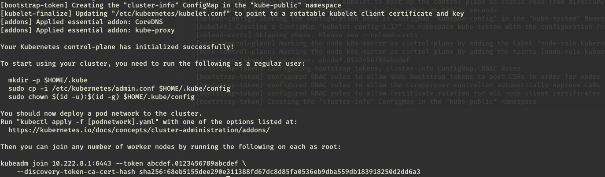
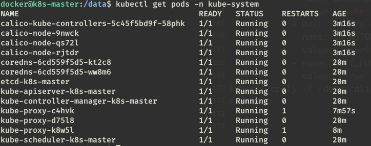
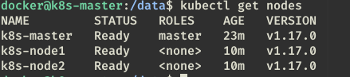

# manual insatll on Ubuntu1804

`all server`
1.
```bash
cat /etc/hosts
10.222.8.1 k8s-master
10.222.8.2 k8s-node1
10.222.8.3 k8s-node2
151.101.108.133 raw.githubusercontent.com
```

2. 
```bash
vim /etc/sysctl.d/k8s.conf
net.bridge.bridge-nf-call-ip6tables = 1
net.bridge.bridge-nf-call-iptables = 1
net.ipv4.ip_forward = 1
vm.swappiness = 0
# 生效
modprobe br_netfilter
sysctl -p /etc/sysctl.d/k8s.conf
```

3. 
```bash
vim /etc/sysctl.conf
net.ipv4.ip_forward=1
# 生效
sysctl -p
```

4. 
```bash
curl -fsSL get.docker.com -o get-docker.sh
sh ./get-docker.sh --mirror Aliyun
docker version
```

5. 
```bash
vim /etc/docker/daemon.json
{
  "exec-opts": ["native.cgroupdriver=systemd"],
  "registry-mirrors" : [
    "https://ot2k4d59.mirror.aliyuncs.com/"
  ]
}

# 生效
systemctl daemon-reload && systemctl enable docker && systemctl start docker
```

6. 
```bash
sudo curl -s https://mirrors.aliyun.com/kubernetes/apt/doc/apt-key.gpg | sudo apt-key add -

sudo tee /etc/apt/sources.list.d/kubernetes.list <<-'EOF'
deb https://mirrors.aliyun.com/kubernetes/apt kubernetes-xenial main
EOF

sudo apt-get update
sudo apt-get install -y kubelet kubeadm kubectl
```
```bash
kubeadm version
kubeadm version: &version.Info{Major:"1", Minor:"17", GitVersion:"v1.17.0", GitCommit:"70132b0f130acc0bed193d9ba59dd186f0e634cf", GitTreeState:"clean", BuildDate:"2019-12-07T21:17:50Z", GoVersion:"go1.13.4", Compiler:"gc", Platform:"linux/amd64"}
```
```bash
systemctl enable kubelet.service
```

7.  
`master`
```bash
cat << EOF >> /etc/modules
ip_vs
ip_vs_rr
ip_vs_wrr
ip_vs_sh
nf_conntrack_ipv4
EOF
```

8. 
`master`
```bash
apt-get install ipset
apt-get install ipvsadm
```

9. 
`master`
```bash
kubeadm config print init-defaults > /data/kubeadm.yaml
# 更改
```
```yaml
apiVersion: kubeadm.k8s.io/v1beta2
bootstrapTokens:
- groups:
  - system:bootstrappers:kubeadm:default-node-token
  token: abcdef.0123456789abcdef
  ttl: 24h0m0s
  usages:
  - signing
  - authentication
kind: InitConfiguration
localAPIEndpoint:
  advertiseAddress: 10.222.8.1
  bindPort: 6443
nodeRegistration:
  criSocket: /var/run/dockershim.sock
  name: k8s-master
  taints:
  - effect: NoSchedule
    key: node-role.kubernetes.io/master
---
apiServer:
  timeoutForControlPlane: 4m0s
apiVersion: kubeadm.k8s.io/v1beta2
certificatesDir: /etc/kubernetes/pki
clusterName: kubernetes
controllerManager: {}
dns:
  type: CoreDNS
etcd:
  local:
    dataDir: /var/lib/etcd
imageRepository: gcr.azk8s.cn/google_containers
kind: ClusterConfiguration
kubernetesVersion: v1.17.0
networking:
  dnsDomain: cluster.local
  podSubnet: 192.168.0.0/16
  serviceSubnet: 10.96.0.0/12
scheduler: {}
---
apiVersion: kubeproxy.config.k8s.io/v1alpha1
kind: KubeProxyConfiguration
mode: ipvs
```

```bash
# 初始化,保证cpu大于等于2
kubeadm init --config kubeadm.yaml

```



10. 
`node1`/`node2`
```bash
# 加入节点
sudo kubeadm join 10.222.8.1:6443 --token abcdef.0123456789abcdef \
    --discovery-token-ca-cert-hash sha256:68eb5155dee290e311388fd67dc8d85fa0536eb9dba559db183918250d2dd6a3 
```

11. 
此时查看node还是"NotReady",需要配置网络插件

`master`
```bash
cd /data
wget https://docs.projectcalico.org/v3.8/manifests/calico.yaml
sed -n '590,596p' calico.yaml
            - name: DATASTORE_TYPE
              value: "kubernetes"
            # Wait for the datastore.
            - name: IP_AUTODETECTION_METHOD  # DaemonSet中添加该环境变量
              value: interface=enp0s3   # 指定内网网卡
            - name: WAIT_FOR_DATASTORE
              value: "true"
kubectl apply -f /data/calico.yaml
```
 等待如下:
 

再看node状态


11. 
`master`
```bash
sed -n '112,113p' kubernetes-dashboard.yaml
        #image: k8s.gcr.io/kubernetes-dashboard-amd64:v1.10.1
        image: gcr.azk8s.cn/google_containers/kubernetes-dashboard-amd64:v1.10.1

tail -n 3 kubernetes-dashboard.yaml
  selector:
    k8s-app: kubernetes-dashboard
  type: NodePort
```
```bash
kubectl apply -f kubernetes-dashboard.yaml
kubectl get pods -n kube-system -l k8s-app=kubernetes-dashboard
NAME                                   READY   STATUS    RESTARTS   AGE
kubernetes-dashboard-7c9964c47-6mhw5   1/1     Running   0          106s
```

访问dashboard
[service](https://10.222.8.1:32039)
```bash
kubectl get svc -n kube-system|grep dashboard
kubernetes-dashboard   NodePort    10.96.238.47   <none>        443:32039/TCP            8m54s
```

[proxy](http://10.222.8.1:8001/api/v1/namespaces/kube-system/services/https:kubernetes-dashboard:/proxy/#!/login)
```bash
nohup kubectl proxy --address=10.222.8.1 --disable-filter=true &
```